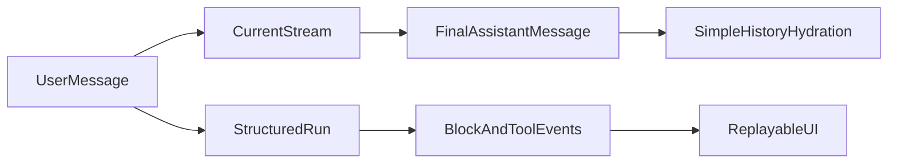

# Chat Architecture Audit

## 1. Purpose

This document compares:

- the previous Lusia chat implementation in `/Users/gui/Lusia - Backend` and `/Users/gui/LusIA - FrontEnd`
- the current student chat implementation in this workspace

It answers three questions:

1. What is structurally better in the old app?
2. What should be copied into the new app?
3. What should be redesigned instead of cloned 1:1?

The conclusion is clear: the old app has the right mental model, but it should be rebuilt more cleanly in this codebase rather than copied file-for-file.

## 2. Reference Files

### 2.1 Previous app

- Backend stream transport: `backend_agents/app/api/http/routers/sse.py`
- Backend session/message API: `backend_agents/app/api/http/routers/sessions.py`
- Backend message persistence: `backend_agents/app/ai_agents/main_graph/memory/supabase_db.py`
- Backend agent node: `backend_agents/app/ai_agents/main_graph/main_ai_agent/lusia_ai_agent.py`
- Frontend stream hook: `src/features/chat/hooks/useSSEChat.ts`
- Frontend session page: `src/app/chat/[session_id]/page.tsx`
- Frontend chat rendering: `src/features/chat/components/ChatContent.tsx`
- Frontend tool registry: `src/features/chat/components/tools/registry.tsx`

### 2.2 Current app

- Backend chat router: `LUSIA Studio - Backend/app/api/http/routers/chat.py`
- Backend stream implementation: `LUSIA Studio - Backend/app/chat/streaming.py`
- Backend chat persistence: `LUSIA Studio - Backend/app/chat/service.py`
- Backend schema: `LUSIA Studio - Backend/migrations/006_chat.sql`
- Frontend stream hook: `LUSIA Studio - Frontend/lib/hooks/use-chat-stream.ts`
- Frontend page orchestration: `LUSIA Studio - Frontend/components/chat/ChatPage.tsx`
- Frontend chat rendering: `LUSIA Studio - Frontend/components/chat/ChatContent.tsx`
- Frontend tool registry: `LUSIA Studio - Frontend/components/chat/tools/registry.tsx`

## 3. Executive Summary

The current app is conversation-centric and final-message-centric.

- A user sends a message.
- The backend streams tokens and a few tool updates.
- The frontend accumulates a temporary live assistant state.
- At the end, the backend saves one final assistant message with a summarized `tool_calls` payload.
- When history is reloaded, only `user` and `assistant` rows are hydrated.

The previous app is run-centric and event-centric.

- A session exists independently from a run.
- Each turn produces a structured stream of blocks, tool lifecycle events, metadata, subgraph progress, and completion stats.
- The frontend renders blocks and tool components directly from the event stream.
- Human-in-the-loop resume flows are first-class.

That old architecture is materially better for:

- replayability
- tool-rich UX
- resumability
- artifact generation
- debugging
- observability
- future feature growth

## 4. Core Difference

The current app stores the answer.

The previous app stores enough structure to understand how the answer was produced.

That difference matters because "amazing chat" is rarely about plain text only. It is about:

- rich tool feedback
- dependable refresh/reload behavior
- exact artifact rendering
- good cancellation and retry semantics
- future support for approvals, interruptions, and multi-step agent work

## 5. What The Current App Does Well

The current implementation already has a few solid foundations worth keeping:

- FastAPI backend with a simple LangGraph loop is a good base.
- Next.js API proxies are a good transport boundary.
- The chat is already conversation-based and backed by Supabase.
- The frontend already has optimistic message insertion and basic tool cards.
- The schema already reserves room for `tool_calls`, `tool_call_id`, `tool_name`, and `metadata`.

These are good starting points, but they are not yet a durable chat architecture.

## 6. Main Gaps In The Current App

### 6.1 History is lossy

In `app/chat/streaming.py`, previous history is rebuilt from database rows, but only `user` and `assistant` rows are turned back into LangChain messages. Tool and system turns are skipped.

This means:

- the model cannot faithfully replay prior tool reasoning
- tool outputs are not part of durable conversational state
- refresh behavior and model replay diverge

### 6.2 The stream contract is too small

The current stream mainly exposes:

- `run_status`
- `token`
- `tool_call`
- `tool_call_args`
- `tool_result`
- `error`

This is enough for a simple demo, but not for a production-grade tool-aware assistant.

Missing concepts include:

- block boundaries
- tool call lifecycle identity
- structured metadata events
- resumable action events
- completion summaries
- stable per-run sequencing

### 6.3 Final persistence is too compressed

The backend currently stores one assistant row with plain text plus summarized `tool_calls`.

That makes it difficult to:

- reconstruct the exact live UI after reload
- distinguish transcript data from UI rendering data
- support richer tool renderers over time
- debug failures or partial turns

### 6.4 Client and server identities are weakly coordinated

The frontend creates optimistic message ids with `crypto.randomUUID()`, while the server creates different persistent ids in the database.

This is workable, but not ideal for:

- deduplication
- retries
- cancelled streams
- analytics
- partial refresh after errors

### 6.5 Some request data is encoded as markup

The current UI uses frontend-only markup patterns such as image wrappers and context tags inside message content.

That is convenient for local rendering, but it should not remain the long-term transport contract.

Request data like this should become explicit typed fields:

- attachments
- context selections
- flags
- artifacts
- resume decisions

## 7. What Should Be Copied From The Old App

These patterns are worth carrying over almost directly.

### 7.1 Separate sessions from runs

The previous app clearly distinguishes:

- session creation/listing
- a specific stream run for a turn

This is better than binding everything to a single "message POST" mental model.

Recommendation:

- keep `chat_conversations` for thread identity
- introduce `chat_runs` for each streamed assistant turn

### 7.2 Use a structured event stream

The old app's stream taxonomy is much closer to what a real agent UI needs.

Recommendation:

- keep SSE
- keep typed events
- keep tool lifecycle frames
- keep block grouping
- keep a completion event with usage and status data

### 7.3 Render tools through a registry

The old frontend tool registry is a strong pattern because it localizes feature growth.

Recommendation:

- keep the registry idea
- keep per-tool renderer components
- do not move tool rendering logic into one giant chat bubble component

### 7.4 Design for resumability

The old app proves that human-in-the-loop and resume flows fit naturally when runs are first-class.

Recommendation:

- design the new architecture to support resume now
- even if only a small subset of tools uses it at first

## 8. What Should Not Be Copied 1:1

The old app is not a perfect clone target.

### 8.1 Do not recreate a giant stream router

The previous `sse.py` is powerful, but too centralized.

Recommendation:

- split stream responsibilities into small modules
- event normalization
- persistence
- stream transport
- replay compaction
- run completion

### 8.2 Do not duplicate full conversation truth across too many systems

The old app mixes checkpoints, message logs, and UI-oriented state.

Recommendation:

- define one canonical transcript model
- define one canonical run model
- treat any UI snapshots as derived data, not primary truth

### 8.3 Do not rely on inconsistent tool payload shapes

The old app has multiple paths for tool content, tool metadata, and tool results.

Recommendation:

- choose one normalized tool shape for persistence
- use that shape everywhere

### 8.4 Do not depend on client-supplied identity where server auth already exists

The current app correctly uses authenticated users in the backend router.

Recommendation:

- keep server-authenticated user identity as the source of truth
- only use client ids for optimistic correlation and idempotency

## 9. Recommended Target Architecture

The new app should use a run-centered architecture built on top of the existing chat feature.

### 9.1 Canonical data model

Keep transcript and run concerns separate on purpose.

#### `chat_conversations`

Keep the existing thread table for sidebar identity and thread metadata.

#### `chat_runs`

Add a new table for each streamed assistant turn.

Recommended fields:

- `id`
- `conversation_id`
- `user_id`
- `status` (`queued`, `streaming`, `requires_action`, `completed`, `failed`, `cancelled`)
- `request_payload`
- `started_at`
- `completed_at`
- `error_code`
- `error_message`
- `idempotency_key`
- `user_message_id`
- `assistant_message_id`

#### `chat_messages`

Keep this as the canonical transcript.

Recommended roles:

- `user`
- `assistant`
- `tool`
- `system`

Recommended additions:

- `run_id`
- `sequence`
- `content_blocks` JSONB for assistant UI replay
- `tool_calls` JSONB for assistant tool-call declarations
- `tool_call_id`
- `tool_name`
- `metadata`

#### `chat_run_events`

Add a run event log for streaming structure and diagnostics.

Recommended fields:

- `id`
- `run_id`
- `seq`
- `event_type`
- `block_id`
- `payload`
- `created_at`

This table should store structured events, not raw token spam forever. Persist:

- structural events
- tool lifecycle milestones
- resumability events
- completion events
- optionally token deltas only when needed for debugging or short retention

### 9.2 Canonical responsibilities

Use this rule:

- `chat_messages` is the transcript truth
- `chat_runs` is the execution truth
- `chat_run_events` is the stream and observability truth

This is cleaner than the old app because each layer has a distinct responsibility.

### 9.3 Target stream contract

The current frame set should be expanded into a stable typed contract.

Recommended event families:

- `run.started`
- `run.updated`
- `run.completed`
- `run.failed`
- `run.requires_action`
- `assistant.block.started`
- `assistant.block.delta`
- `assistant.block.completed`
- `tool.call.started`
- `tool.call.delta`
- `tool.call.completed`
- `tool.result`
- `tool.metadata`
- `usage.updated`

This is conceptually the same as the old app, but with more explicit naming and cleaner ownership.

### 9.4 Assistant replay model

Do not rely on raw streaming events to hydrate normal chat history.

Instead:

- compact each completed run into a durable assistant message snapshot
- store that snapshot in `chat_messages.content_blocks`
- use `content_blocks` to render tool-aware historical messages quickly
- keep `chat_run_events` for diagnostics, advanced replay, and resume support

This is the biggest recommended improvement over both the current app and the old app.

It gives:

- fast history hydration
- stable historical rendering
- room for rich tool cards
- reduced frontend reconstruction logic

### 9.5 LLM replay model

When rebuilding model context for the next turn:

- include prior `user`
- include prior `assistant`
- include prior `tool`
- include any required `system` snapshot or regenerated system prompt

Do not skip tool rows.

If tool messages are not in replay, the assistant's conversational memory is incomplete.

## 10. Recommended Product Decisions

These are the decisions I recommend for this app.

### 10.1 Blocks

Decision: keep block semantics, but simplify them.

Definition:

- a block is one coherent assistant work segment inside a run
- blocks can contain text, tool activity, and artifacts

Why:

- preserves the strongest part of the old UI
- supports multi-step agent work
- keeps the frontend composable

### 10.2 Tool persistence

Decision: tools should be first-class transcript messages and first-class run events.

Use both because they serve different purposes:

- transcript tool rows are needed for LLM replay
- run events are needed for live UX, debugging, and resume

The assistant message should also store compact `content_blocks` for easy historical rendering.

### 10.3 Resumability

Decision: design for resume now and implement the run lifecycle now.

Even if only a few tools use approvals or interruptions at first, the architecture should support:

- `requires_action`
- `resume`
- `cancel`
- `retry`

This is cheaper to add now than to retrofit later.

### 10.4 Replay goal

Decision: optimize for both transcript fidelity and UI fidelity, but with different storage layers.

- transcript fidelity comes from `chat_messages`
- UI fidelity comes from `content_blocks` and `chat_run_events`

That is intentional duplication of representation, not accidental duplication of truth.

## 11. Migration Plan For This Workspace

### Phase 1: Data model

1. Add `chat_runs`.
2. Extend `chat_messages` with `run_id`, `sequence`, and `content_blocks`.
3. Add `chat_run_events`.
4. Backfill existing assistant rows with empty `content_blocks` defaults.

### Phase 2: Backend execution model

1. Split `app/chat/streaming.py` into smaller modules.
2. Create a run orchestrator that:
   - creates a run
   - saves the user message
   - streams typed events
   - persists tool rows
   - compacts the final assistant snapshot
   - marks the run complete or failed
3. Rebuild history using full transcript rows, including tool messages.

### Phase 3: Frontend stream model

1. Replace `use-chat-stream.ts` with a typed run-aware hook.
2. Track:
   - `run`
   - `blocks`
   - `tool calls`
   - `usage`
   - `requires_action`
3. Reconcile optimistic client messages with server-created run and message ids.

### Phase 4: Historical rendering

1. Change history hydration so assistant messages render from `content_blocks`.
2. Keep the tool registry pattern.
3. Make reload behavior visually match live streaming behavior as closely as possible.

### Phase 5: Product hardening

1. Add cancel and retry semantics per run.
2. Add idempotency keys per user send action.
3. Add better failure states for partial tool execution.
4. Add observability around run failures and tool latency.

## 12. Concrete Recommendation

Do not copy the old app 1:1.

Instead, use it as the reference architecture for:

- stream richness
- block semantics
- tool lifecycle modeling
- registry-based rendering
- resumability

Then improve it in this app by introducing:

- a first-class `chat_runs` model
- a cleaner event contract
- full transcript replay including tool rows
- assistant `content_blocks` snapshots for stable history rendering
- smaller backend modules instead of one monolithic stream file

## 13. Final Decision

The best target for LUSIA Studio is:

- old app concepts
- current app auth and proxy boundaries
- a cleaner persistence model than either app currently has

That gives the new app a chat architecture that is richer than the current version, easier to evolve than the old version, and much safer for future tool-heavy agent workflows.
